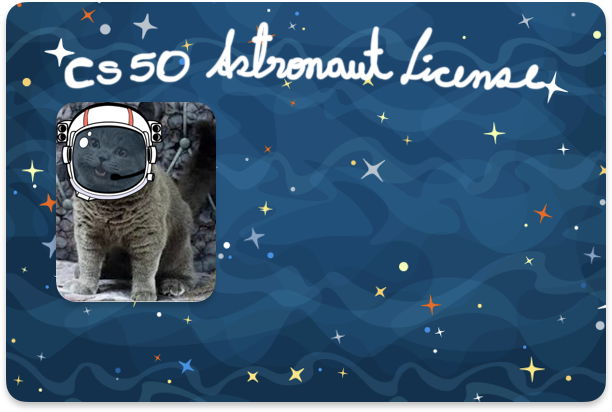

# Tools and game software
#### Video Demo: https://youtu.be/moHR-dwr3Ks
#### Description:

The tools and game software program was designed as a useful collection of Python functionalities. At first, I wanted to create something related to computer graphics, like a game similar to Just Dance but implemented using Python libraries. However, I eventually decided not to pursue this option since my computer does not have a camera. Then I thought: wouldn't it be nice to have a software that gathers the activities I enjoyed the most throughout the course? That idea inspired me to design this project.

The program starts at ```main()```, printing a figlet header and showing a simple numeric menu. This ```menu()``` prints three options and uses a ```while True``` and ```try/except``` loop. Here any non-numeric or out of range input would raise a ```ValueError``` and reprompt, ensuring a robust input handling. After finishing each of the features available at ```main()``` the function ```restart()``` allows the user to return to the main menu if they'd like to, thus keeping the program active. It is also worth mentioning that the function ```header()``` helps us render large ASCII title not only here but also in any please we need one.

The program aims to provide several features, these features are mainly three. First, there is a customized version of cowsay, where instead of only a cow, the user can choose from different animals and make them speak custom messages. In ```cow()``` we provide a full list of animals with ```cowsay.char_names``` and we place together the animal and the custom message via ```getattr(cowsay, animal)(message)```.

The second feature is a qr code generator, inspired by something I once saw in CS50x, which allows the user to input text and generate a qr code image saved locally as ```qr.png```. ```qr()``` asks for the qr content, creates it with ```qrcode.make()``` and saves the image file.

Initially, I had also considered adding PDF functionalities such as file conversion and OCR. However, I realized it wasn't worth it since there are already many excellent online services for that purpose. Instead of the PDF tools, I decided to focus on creating a game.

This game is called Become an Astronaut Today.

Game Structure:

- Level 1 Trivia (4 questions)
- Level 2 Math skills (3 questions)
- Level 3 Word puzzle
- A score > 6 awards the license, otherwise the mission fails.

It works like a fun astronaut exam where the user is challenged with different types of questions. As previously shown in the game structure, the game is divided into three levels. The first level contains four general knowledge questions, in the second level, there are three math questions and finally in the third level, there is a word puzzle where the player must guess missing letters in the word shown in this case the word is "ASTRONAUT", the user only has 3 attempts and will only be awarded a point for every correctly guessed letter.

The license itself was created using resources from the internet it contains: CS50's cat with an astronaut helmet! and a custom title designed by me. The template file is named ```template.PNG``` and looks like this:



When the user successfully passes the game, the program asks for their name and then generates a new file called ```license.PNG``` containing their personalized astronaut license. The function ```license()``` opens the template as RGBA, draws the user's name with Pillow and depending on how long the name is it will pick a font size of 40 or 20 to prevent a long name to go out of bounds and finally exports the license's file. The file ```super.ttf``` is the font that we use to print the name in the license.

To make the program work smoothly functions such as ```user_response()``` were also developed. This one allows the program to handle yes or no inputs from the user allowing the program to pause and then keep running or in case of choosing no the program would exit gracefully via ```sys.exit```.

Finally we have ```test_project.py```. Here we have the test of  ```header()``` with ```test_header()``` we assert that after passing a string to the function if it works propertly it would print as a side effect the figlet ASCII art but most importantly a string that shows that the function was executed top to bottom. The second test we have is ```test_print_options()``` the function ```print_options()``` takes ints these ints were used to print as a side effect the options for a set of questions, it the int given by the "user" doesn't contain a set of questions it will return a string indicating that no questions were found for instance: ```assert print_options(1) == "Questions q1 printed successfully"```, ```assert print_options(-10) == "No questions found at -10"``` and passing any kind of string to this function will raise a ```ValueError```. The third test is ```test_valid()```, this tests ensures that the function correctly compares the characters a, b or c in a way that if a is equal to a it will return 1 if the characters are different meaning that that is not a valid answer the function will return 0, the function itself also prints a side effect giving the user a correct 😀 or incorrect 🙁 message accordingly to the answer.


#### References:

* License: <br>
    Background : https://www.freepik.com/free-vector/cartoon-background-with-stars_1076870.htm<br>
    Helment: https://creazilla.com/media/clipart/23739/space-helmet<br>
    Font: https://www.dafont.com/super-squad.font

* Libraries:
https://pillow.readthedocs.io/en/stable/index.html
https://pypi.org/project/qrcode/
https://pypi.org/project/pyfiglet/
https://pypi.org/project/cowsay/

